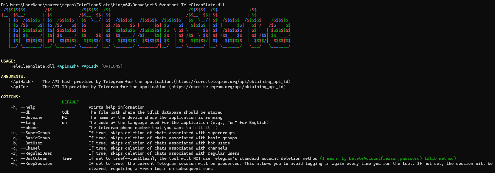
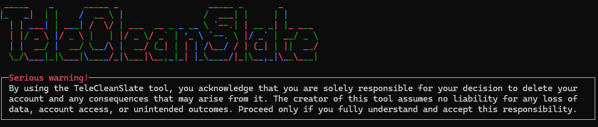

# TeleCleanSlate(beta)

**TeleCleanSlate** is a simple tool designed to assist users in **permanently deleting their Telegram accounts and all associated data**. Unlike the standard account deletion method provided by Telegram, which leaves messages and files accessible to other users, **TeleCleanSlate aims to remove as many traces as possible**. With its command-line interface and comprehensive automation, TeleCleanSlate offers a secure and thorough method for managing the deletion process.

> **Warning:** This tool performs **complete and irreversible deletion** of your Telegram account and data. Proceed only if you fully understand the consequences.

---

## ⚠️ Important Warnings

- **Permanent Deletion:** Once the account is deleted, **it cannot be recovered**. All messages, contacts, and chat histories will be lost forever.
- **Backup First:** Ensure you back up your important data. Telegram Desktop offers an [export feature](https://telegram.org/blog/export-and-more) that you can use.
- **No Liability:** The creator of this tool assumes **no responsibility** for any data loss or unintended consequences.

---

## 🔧 Features

- **Account Deletion Automation:** Streamlined deletion of Telegram accounts using the official Telegram API.
- **Interactive CLI Prompts:** Guided input prompts for user confirmation and critical data entry.
- **Secure Password Handling:** User password verification before deletion.
- **Randomized Logo Display:** Dynamic, visually engaging logo during startup.

---

## 🚀 Getting Started

### Prerequisites
- .NET 8 SDK or later
- A valid Telegram **API ID** and **API Hash**. You can obtain these from [Telegram API Documentation](https://core.telegram.org/api/obtaining_api_id).

### Installation
Clone the repository and navigate to the project directory:

```bash
git clone <repository-url>
cd TeleCleanSlate
```

### Build

```bash
dotnet build
```

### Run

```bash
dotnet (TeleCleanSlate.dll path) <API_HASH> <API_ID> --phone <YOUR_PHONE_NUMBER>
```
Example:
```bash
dotnet (TeleCleanSlate.dll path) "12345abcd" 987654321 --phone "+1234567890"
```

---

## 🛠 Usage Instructions
1. **Run the Tool:** Start the application as described above.
2. **Read the Warning Panel:** A warning panel will inform you of the serious nature of account deletion.
3. **Acknowledge Responsibility:** Type `I want to delete my account` as confirmation.
4. **Provide Your Credentials:** Enter any additional required information, including password and authentication codes.
5. **Completion:** The tool will log you out and clean up account traces.

---

## 🎨 Screenshots

### Initial Startup


### Warning Panel


---

## 🎥 GIF Demo(just for asciiArt :-)


---

## ⚙️ Command Line Options

| Option | Description |
|--------|-------------|
| `--db` | Specify the path for the database (default: `tdb`). |
| `--devname` | Specify the device name (default: `PC`). |
| `--lang` | Set the language code (default: `en`). |
| `--phone` | Provide the target phone number for deletion. |

---

## 🛡️ Safety Recommendations
- **Archived Messages Reminder:** We do not delete messages in the archive. If you wish to leave traces, archive your messages in Telegram.
- **Export Your Data:** Use Telegram Desktop's data [export feature](https://telegram.org/blog/export-and-more) to back up your chats, contacts, and media.
- **Secure API Credentials:** Keep your API ID and Hash confidential.
- **Double Check:** Make sure you truly want to delete your account before proceeding.

---

## 📢 Disclaimer
By using this tool, you acknowledge that you are **solely responsible** for your decision to delete your account and any consequences that may arise from it. The creator assumes **no liability** for data loss or unintended outcomes.

---

## 🤝 Contributions
Feel free to open issues or submit pull requests to improve this tool.

---

## 📝 Final Notes
If you’re unsure about account deletion, reconsider your decision and explore alternative account management options.

If the tool doesn't work, behaves as though it can't connect to Telegram, or immediately requests a code, you can try the following steps:

1. **Use a good VPN:** Some regions may restrict Telegram access.
2. **Change the VPN server:** Switching servers might improve connectivity.
3. **Rebuild the program:** Delete the application folder and rebuild it.
4. **Debug the tool:** If you're familiar with programming, try debugging to find the issue.
5. **Report an Issue:** If you're not familiar with debugging, please open an issue in the project's GitHub page.

---

## 📚 Built Using

TeleCleanSlate is developed using the following libraries:

- **Spectre.Console.Cli:** For a robust and customizable command-line interface with colorful output and control elements.
- **TdLib:** The Telegram Database Library for interacting with the Telegram API.
- **log4net:** For logging error information and debugging insights.
